<div align="center">



<br/>

[](https://git.io/typing-svg)

<br/>

<a href="https://www.linkedin.com/in/amanjaiswal143143/"></a>&nbsp;
<a href="mailto:i.aman02jaiswal@gmail.com"></a>&nbsp;
<a href="https://my-portfolio-aman-jaiswal.vercel.app/"></a>&nbsp;
<a href="https://leetcode.com/amanjaiswal__143"></a>&nbsp;
<a href="https://kaggle.com/amanjaiswal143143"></a>

</div>

<br/>

<br/>

## `// 01 — FEATURED PROJECTS`

<table>
<tr>
<td width="50%" valign="top">

`root@aman:~$ open ultrasound_ai_reporting`

**Vision-Language Model** for ultrasound image understanding and automated clinical report generation. Research-grade pipeline built at IIT Mandi.

`Vision Transformer` `NLP` `PyTorch` `TensorFlow` `Medical AI`

</td>
<td width="50%" valign="top">

`root@aman:~$ open rakshak_ai` &nbsp;``

**Emergency response platform** — GPS-based SOS, guardian tracking, offline fallback. Winner, Enfinity Hackathon.

`Next.js` `TypeScript` `Supabase` `AI APIs`

</td>
</tr>
<tr>
<td width="50%" valign="top">

`root@aman:~$ open job_hunt`

**Full-stack job platform** — aggregation, structured search, filtering, and application-status pipelines.

`Next.js` `Node.js` `MongoDB` `REST API`

</td>
<td width="50%" valign="top">

`root@aman:~$ open object_following_bot`

**Autonomous tracking robot** using YOLOv8 and OpenCV in real time, deployed on embedded hardware.

`YOLOv8` `OpenCV` `Python` `Embedded Systems`

</td>
</tr>
<tr>
<td width="50%" valign="top">

`root@aman:~$ open gullak`

**Financial forecasting platform** with scalable backend architecture and real-time data processing.

`Node.js` `Express.js` `PostgreSQL` `REST API`

</td>
<td width="50%" valign="top">

<br/>

<sub>`> more builds compiling...` — check pinned repositories for live source.</sub>

</td>
</tr>
</table>

<br/>

<br/>

## `// 02 — STACK`

```
AI / ML        PyTorch · TensorFlow · OpenCV · HuggingFace · YOLOv8
LANGUAGES      Python · C++ · TypeScript · Java · SQL
FRONTEND       Next.js · React · Tailwind CSS
BACKEND        Node.js · Express · PostgreSQL · MongoDB · Docker · Supabase
RESEARCH       Vision Transformers · RAG · Multimodal AI · Medical Imaging
```

<br/>

<br/>

## `// 03 — EXPERIENCE`

**Deep Learning Research Intern** — IIT Mandi&nbsp;&nbsp;`2024 — Present`
- Built a multimodal AI pipeline using Vision Transformers for automated ultrasound report generation
- Engineered an end-to-end inference system optimized for real-world clinical deployment
- Designed scalable AI workflows with measurable performance gains across evaluation sets

**SDE Intern** — Bluestock Fintech&nbsp;&nbsp;`2023`
- Developed and shipped production backend features for a fintech platform

<br/>

<br/>

## `// 04 — ACHIEVEMENTS`

| | |
|---|---|
| **Winner · Enfinity Hackathon** | Gullak -ZERO CLUTTER FINCIAL FORCASTING  |
| **National Finalist · NEYP'25** | Best Leader Award, national-level recognition |
| **GSSoC 2025 Contributor** | GirlScript Summer of Code, open source |
| **Research Intern · IIT Mandi** | Selected for computer vision & medical AI research |
| **Ex-SDE Intern · Bluestock** | Fintech backend engineering |

<br/>

<br/>

## `// 05 — LANGUAGES`

<div align="center">

</div>

<br/>


